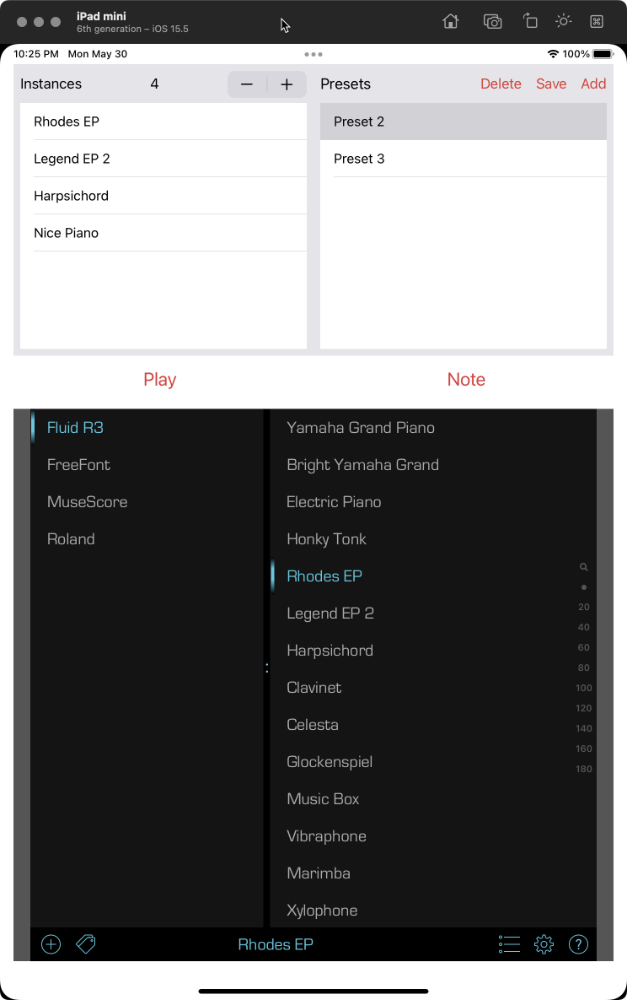

# AUv3Host

This is a simple host application for an AUv3 component. I use it to test out my 
[SoundFonts](https://github.com/bradhowes/SoundFonts) AUv3 extension. 
It is very
loosely based on [code from Apple](https://developer.apple.com/documentation/audiotoolbox/audio_unit_v3_plug-ins/incorporating_audio_effects_and_instruments).
My version allows for multiple instances of the same AUv3 component with user-defined presets for a collection. At
present, only the iOS version is usable -- the macOS version is more or less the same as Apple's code, but it will not
compile in the current state.

# Customizing

If you want to use this host for your own testing purposes, you will simply need to change the definition of the
[componentToLoad](https://github.com/bradhowes/AUv3Host/blob/main/Packages/Sources/AudioUnitHost/AudioUnitHost.swift#L11) 
constant defined in the `AudioUnitHost` file. This controls what AUv3 component `AudioUnitHost` will instantiate. For 
this to work, you must have run the host app that contains your AUv3 component with the same type signature that is
found in the `componentToLoad` constant. If the component is not found, you will receive a prompt saying so from the 
app.

# Using

Right now, you can control the following:

* number of instances of the component defined in the `componentToLoad` variable (see above)
* definition of presets that hold the settings for all of the components

Presets are just a collection of `fullState` values from the active AUv3 components -- if there are 4 instances, then a
preset will have a collection of 4 values, one from each of the `fullState` attributes of an AUv3 component.

There currently two sound buttons:

* `Play` -- start playing a repeating scale of notes for each AUv3 instance
* `Note` -- play a single note for the currently active AUv3 component. Useful to hear the output of just one component.

# Dependencies

The project itself consists of three internal Swift packages:

* AudioUnitHost -- the hosting code for the AUv3 components
* PresetDocumentManager -- handles preset creation, updating, and deletion as well as saving and restoring from 
`UserDefaults`
* TypedFullState -- conversion between the `fullState` type of `[String: Any]` and a typed-Any representation that can
supports the `Codable` protocol uses to save/restore values to/from `UserDefaults`.

Additionally, the code also depends on the external [AUv3Support](https://github.com/bradhowes/AUv3Support) Swift
package that my AUv3 components also depend on.

